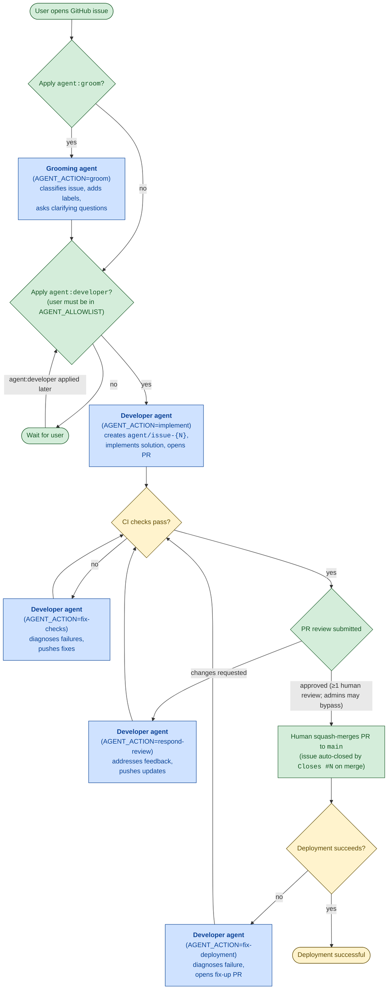

# agentic-development-workflow

A demonstration of AI coding agents integrated into a GitHub issue-based development lifecycle. Each agent has its own GitHub identity, runs in an isolated container per event, and interacts via PR and issue comments — the same channels a human contributor would use.

**This is a demonstration project, not an open project.** Pull requests are limited to collaborators. Issue reports from the public are welcome but may not be acted on. If you want to run this workflow yourself, see [Reproduce this yourself](#reproduce-this-yourself) below.

See [requirements.md](requirements.md) for the full project specification, [AGENTS.md](AGENTS.md) for agent conventions, and [CONTRIBUTING.md](CONTRIBUTING.md) for the contribution policy.

## What this demonstrates

This repository shows how coding agents can participate in a structured, human-gated software development lifecycle on GitHub:

- **Separate agent identities** — each agent (developer, reviewer) authenticates as its own GitHub App, so its actions are distinguishable from human collaborators and from each other.
- **Least-privilege, per-event isolation** — agents run in ephemeral containers, each receiving a short-lived installation token scoped to only the permissions that action requires.
- **Full issue → merge lifecycle** — from grooming and design through implementation, CI, code review, and deployment, every step is driven by GitHub labels and events; humans gate the transitions that matter (applying labels, approving PRs, merging).
- **Human-enforced branch protection** — branch protection on `main` requires at least one human review; agents cannot self-approve or push directly to `main`.

## Agent lifecycle

The complete flow from issue to deployment is:

**issue → groom → (design →) implement → CI → review → respond → merge → deploy**

- A human opens an issue and optionally applies `agent:groom` to classify it and surface clarifying questions.
- For complex issues the groomer applies the `plan` label; a human applies `agent:design` to produce a design document and draft sub-issues before implementation begins.
- A human applies `agent:developer` to trigger implementation on a fresh branch; the agent opens a PR.
- CI runs automatically; on failure the agent is re-invoked (`fix-checks`) to diagnose and push fixes.
- A human (or the agent itself) applies `agent:review` to request a code review from the reviewer agent.
- On review feedback the developer agent addresses it (`respond-review`) and pushes updates; the cycle repeats until the PR is approved.
- A human squash-merges the approved PR; the issue auto-closes via `Closes #N`.
- On deployment failure the agent opens a follow-up fix-up PR and the cycle restarts.

See [AGENTS.md](AGENTS.md) for the full list of `AGENT_ACTION` values and their required env vars.

## How it works

Day-to-day operation is driven entirely by GitHub labels and events:

- Apply **`agent:groom`** to an issue → the grooming agent classifies it and asks clarifying questions.
- Apply **`agent:developer`** to an issue → the developer agent creates `agent/issue-{N}`, implements a solution, and opens a PR. **If the issue carries the `draft` label the workflow skips with a log line** — implementation is blocked until the corresponding design PR merges and removes the label (see `agent:design` below).
- Apply **`agent:review`** to a PR → the code review agent reviews the changes. (`agent-review.yml` builds `docker/reviewer/` and runs the reviewer container with the `reviewer-agent` App identity.)
- Apply **`agent:design`** to an issue → the designer agent writes a design document on a `design/issue-{N}` branch, opens a PR, and creates sub-issues labeled `draft` to block premature implementation. When the `design/issue-{N}` PR merges, the `agent-design` workflow automatically removes the `draft` label from every sub-issue of the parent issue, unblocking the developer agent for each one.
- CI failure on an agent-authored PR → the agent is re-invoked to fix the checks. (**Note:** `agent-fix-checks` is wired to a workflow named `CI`; this step won't fire until a workflow with that name exists in the repo.)
- PR review submitted on an agent-authored PR → the agent addresses feedback and pushes.
- Deployment failure → the agent opens a follow-up fix-up PR. (Triggers on any `deployment_status` failure; skips cleanly unless it can map the failing deployment SHA to a PR containing `Closes #N`.)
- Add a **`model:<name>`** label (e.g. `model:opus`, `model:haiku`) to override the default Claude model for that issue's or PR's run. Works on both issues (developer/grooming/fix-deployment runs) and PRs (`agent:review` runs). The grooming agent automatically selects and applies one of these labels based on issue complexity — if a `model:*` label is already present when the grooming agent runs, it will leave it unchanged. At most one `model:*` label is allowed; workflows fail loudly if more than one is present.

Only usernames (and agent bot identities such as `<developer-agent-app-slug>[bot]`) in the Terraform-managed `AGENT_ALLOWLIST` can trigger the label-driven workflows (`agent:groom`, `agent:developer`, `agent:review`, `agent:design`). The agent bots are included so an agent can apply `agent:*` labels to hand work off — for example, the developer agent applying `agent:review` on its own PR to request a code review. Event-driven workflows then apply their own gates: `fix-checks`/`respond-review` run only for developer-agent PRs, and `fix-deployment` runs on any failed `deployment_status` event and skips cleanly unless it can map the deployment SHA to a PR containing `Closes #N`.

See [AGENTS.md](AGENTS.md) for the full list of `AGENT_ACTION` values and their required env vars.

## SDLC diagram

The diagram below shows the end-to-end issue → merge → deploy lifecycle, including which steps are performed by agents (blue) and which require a human decision (green). Label-driven triggers are shown on the edges.



Notes on the diagram:

- **Human gates** (green) are the only places a person is required: opening the issue, applying `agent:*` labels, submitting a PR review, and squash-merging. Branch protection on `main` requires at least one human review before merge for non-admins — agents cannot self-approve. Repository admins can bypass the review requirement and merge via PR without a prior review (see the Terraform ruleset note in the [Reproduce this yourself](#reproduce-this-yourself) section).
- **Agent steps** (blue) each run as a fresh container invocation of the developer agent image with a specific `AGENT_ACTION`. See [AGENTS.md](AGENTS.md#agent-actions) for the required env vars per action.
- **System checks** (yellow) are automated (GitHub Actions workflow checks, deployment status events) and drive the feedback loops back into the agent. **Note:** the CI failure feedback loop (`fix-checks`) requires a workflow named `CI` to exist in the repo — see the caveat in the "How it works" section above.
- `fix-deployment` re-enters the flow at the CI/checks stage because it opens a new PR that goes through the same CI → review → merge lifecycle as any other change (including the `fix-checks` feedback loop if checks fail).

## Reproduce this yourself

The steps below describe how to wire up the same workflow in your own GitHub repository. Most repo-side configuration (Terraform settings, GitHub Actions workflows, and agent images) is in this repo — fork it and follow the steps; a few one-time manual steps outside version control (creating GitHub Apps, adding secrets) are also required and are covered in the steps below.

### 1. Create the agent GitHub Apps (one-time, manual)

Terraform cannot create GitHub Apps, so do this first in the GitHub UI under **Settings → Developer settings → GitHub Apps → New GitHub App**. Create two Apps:

**developer-agent**
- Repository permissions: Contents (R/W), Issues (R/W), Pull requests (R/W), Workflows (R/W), Metadata (R), Checks (R), Deployments (R)
- Subscribe to events: Issues, Pull request, Pull request review, Check run, Deployment status
- Webhook: **uncheck "Active"** — the GitHub UI otherwise requires a Webhook URL, and this project uses `workflow_dispatch` rather than webhooks.
- After creation: note the **Client ID** (labelled "Client ID" in the App's General settings page — a string like `Iv23.xxxxxxxxxxxxxxxx`, **not** the numeric "App ID") and generate + download a **private key** (`.pem`).

**reviewer-agent**
- Repository permissions: Contents (R), Issues (R/W), Pull requests (R/W), Metadata (R), Checks (R)
- Subscribe to events: Pull request, Pull request review, Issue comment
- Webhook: **uncheck "Active"** (same reason as above).
- After creation: note the **Client ID** (same as above — the `Iv23.xxx` string) and download the private key.

Then install each App on this repository (sidebar → **Install App** → **Install** next to your username → **Only select repositories** → pick `agentic-development-workflow`). That per-repo selection is what scopes the App to this repo; Terraform deliberately does not manage App installations (the GitHub API endpoints for it reject OAuth user tokens, which is what `gh auth token` issues).

### 2. Run Terraform

```bash
cd terraform
cp terraform.tfvars.example terraform.tfvars
# Edit terraform.tfvars:
#   repo_owner           — GitHub user or org that owns the repo
#   repo_name            — repository name (default: agentic-development-workflow)
#   agent_allowlist      — GitHub usernames permitted to trigger agent workflows
#   default_claude_model — repo-wide default Claude model (e.g. "sonnet")

export GITHUB_TOKEN=$(gh auth token)  # or any token with `repo` scope

terraform init

# Import the repo. The ID is the plain repo name — whatever you set for
# var.repo_name in terraform.tfvars (default: agentic-development-workflow).
terraform import github_repository.this "$(terraform console <<<'var.repo_name' | tr -d '"')"

terraform plan
terraform apply
```

Terraform will:
- Codify repo settings (squash-merge only, delete branch on merge, etc.).
- Apply branch protection on `main` via a repository ruleset (PR review required, no force pushes, no deletion, linear history — direct pushes to `main` blocked for everyone, admins included; admins can bypass review only via PR merges).
- Publish `AGENT_ALLOWLIST` and `DEFAULT_CLAUDE_MODEL` as repo-level Actions variables so workflows reference them without hardcoding values in YAML.
- Create the labels consumed by the agent workflows (`agent:developer`, `agent:groom`, `agent:review`, `agent:design`, `model:sonnet`/`opus`/`haiku`, the grooming labels `question`/`bug`/`enhancement`/`dependency upgrade`/`do`/`plan`, `human-required` for issues/PRs needing a human in the loop, and `draft` for sub-issues scoped by an unmerged design) so they show up in the GitHub label picker on issue and pull request creation.

If `terraform apply` errors with `422 already_exists` on a default GitHub label (`bug`, `enhancement`, `question` — these ship pre-created on new repos), import them and re-apply:

```bash
terraform import 'github_issue_label.automation["bug"]'         "$(terraform console <<<'var.repo_name' | tr -d '"'):bug"
terraform import 'github_issue_label.automation["enhancement"]' "$(terraform console <<<'var.repo_name' | tr -d '"'):enhancement"
terraform import 'github_issue_label.automation["question"]'    "$(terraform console <<<'var.repo_name' | tr -d '"'):question"
```

App private keys are deliberately **not** managed by Terraform — keeping them out of `terraform.tfstate` is the whole point. Set them as repo Actions secrets out of band (next step).

### 3. Set App credentials and API keys as Actions secrets

Run once after `terraform apply`, and again whenever you rotate a key:

```bash
# Required — used by all current agent workflows
gh secret set DEVELOPER_APP_ID         --body "<developer App Client ID>"  # the Iv23.xxx Client ID, not the numeric App ID
gh secret set DEVELOPER_APP_PRIVATE_KEY < ~/.config/agentic-agents/developer-agent.pem
gh secret set ANTHROPIC_API_KEY        --body "<anthropic api key>"

# Required for the reviewer agent (used by agent-review.yml)
gh secret set REVIEWER_APP_ID          --body "<reviewer App Client ID>"   # the Iv23.xxx Client ID, not the numeric App ID
gh secret set REVIEWER_APP_PRIVATE_KEY < ~/.config/agentic-agents/reviewer-agent.pem
```

Workflows use `DEVELOPER_APP_ID` / `DEVELOPER_APP_PRIVATE_KEY` to mint short-lived installation tokens for developer-agent runs, and `REVIEWER_APP_ID` / `REVIEWER_APP_PRIVATE_KEY` for reviewer-agent runs (`agent-review.yml`). All workflows pass `ANTHROPIC_API_KEY` through to the container. **Important:** despite the `_APP_ID` suffix, these secrets must hold the GitHub App **Client ID** (the `Iv23.xxx` string visible in the App's General settings), which is the value forwarded as `client-id` to `actions/create-github-app-token`. The separate numeric "App ID" shown on the same page is not used here.

### 4. Build the developer agent container

The image is built on-demand inside each workflow (see [`.github/workflows/`](.github/workflows/)). To build locally for testing:

```sh
docker build -t agent-developer ./docker
```

Run locally against an issue (example — `AGENT_ACTION=implement`):

```sh
# Export secrets into your shell first; using -e VARNAME (not -e KEY=VALUE) keeps
# values out of the docker run command text and shell history
# (the values will still be present in the container environment).
export GH_TOKEN=$(gh auth token)    # or set from another source
[ -n "${ANTHROPIC_API_KEY:-}" ] || { read -rsp "ANTHROPIC_API_KEY: " ANTHROPIC_API_KEY && echo && export ANTHROPIC_API_KEY; }

docker run --rm \
  -e ANTHROPIC_API_KEY \
  -e GH_TOKEN \
  -e GITHUB_REPO="owner/repo" \
  -e AGENT_ACTION="implement" \
  -e GITHUB_ISSUE_NUMBER="1" \
  -e CLAUDE_MODEL="sonnet" \
  agent-developer
```

See [AGENTS.md](AGENTS.md#agent-actions) for the full matrix of `AGENT_ACTION` values and their required env vars.

### 5. Build and run the reviewer agent container

The reviewer image lives at `docker/reviewer/`, separate from the developer image at `docker/`. In CI, `agent-review.yml` builds and runs it automatically when the `agent:review` label is applied to a PR. The same image can be run locally to validate a review pass against a real PR.

**Build**

```sh
docker build -t agent-reviewer ./docker/reviewer
```

**Credentials**

The container needs two secrets: a GitHub token (`GH_TOKEN`) with **Contents read**, **Pull requests read/write**, and **Checks: read** on the target repo, and an Anthropic API key (`ANTHROPIC_API_KEY`). Contents read is required because the reviewer entrypoint clones the repo and checks out the PR branch; Pull requests read/write is required to post the review; Checks: read is required because the entrypoint calls `gh pr checks` to fetch CI check status and include it in the review prompt.

*Sourcing `GH_TOKEN`*

Option A — your personal GitHub token (simplest, for local testing):

```sh
export GH_TOKEN=$(gh auth token)
```

Reviews are posted under your GitHub identity rather than the reviewer-agent bot. This is fine for validating review logic locally; in CI the review is attributed to the reviewer-agent App.

Option B — reviewer-agent installation token (matches CI exactly):

If you need the review to appear as coming from the `reviewer-agent` bot, mint a short-lived installation token from the App's private key. You need the **numeric App ID** (visible on the App's settings page at `https://github.com/settings/apps/<app-name>` — it is a plain integer, not the `Iv23.xxx` Client ID) and the private key downloaded in step 1 (the `.pem` file).

> **Note on App ID vs. Client ID:** The CI workflow uses `.github/actions/agent-token`, which calls `actions/create-github-app-token` via the `client-id` input — it expects the `Iv23.xxx` Client ID. If your `REVIEWER_APP_ID` repository secret contains the Client ID (valid for that action), it **will not work** as `APP_ID` here — the GitHub JWT API requires the numeric App ID in the `iss` claim. To find the numeric ID, open the App's settings page and look for the plain-integer "App ID" field; it is distinct from the Client ID shown further down the page.

> **Tip:** The guards in this snippet use `exit 1` for error reporting. If you paste it directly into an interactive shell session, a failure will close that session. To avoid this, paste the snippet into a script file and run it, or wrap the whole block in a subshell — but note that a subshell will not export `GH_TOKEN` to the parent shell, so you would need to re-export it after (`export GH_TOKEN="$(...)"` form).

```sh
# Requires: openssl, curl, jq
APP_ID="123456"                            # numeric GitHub App ID (not the Iv23.xxx Client ID)
OWNER="your-org-or-user"
REPO="your-repo"
KEY_FILE="$HOME/.config/agentic-agents/reviewer-agent.pem"

[ -f "$KEY_FILE" ] && [ -r "$KEY_FILE" ] || \
  { echo "KEY_FILE not found or not readable: $KEY_FILE"; exit 1; }

_b64url() { openssl enc -base64 -A | tr '+/' '-_' | tr -d '='; }
now=$(date +%s)
jwt_header=$(printf '{"alg":"RS256","typ":"JWT"}' | _b64url)
jwt_payload=$(printf '{"iat":%s,"exp":%s,"iss":%s}' \
  "$((now - 60))" "$((now + 600))" "$APP_ID" | _b64url)
jwt_sig=$(printf '%s.%s' "$jwt_header" "$jwt_payload" \
  | openssl dgst -sha256 -sign "$KEY_FILE" | _b64url)
JWT="${jwt_header}.${jwt_payload}.${jwt_sig}"

# Fetch the installation for the specific repo (avoids picking the wrong
# installation when the App is installed on multiple accounts/repos)
installation_id=$(curl -sf \
  -H "Authorization: Bearer $JWT" \
  -H "Accept: application/vnd.github+json" \
  "https://api.github.com/repos/${OWNER}/${REPO}/installation" \
  | jq -r '.id')

[ -n "$installation_id" ] && [ "$installation_id" != "null" ] || \
  { echo "No installation found for ${OWNER}/${REPO} — check APP_ID and that the App is installed on the repo."; exit 1; }

_token=$(curl -sf -X POST \
  -H "Authorization: Bearer $JWT" \
  -H "Accept: application/vnd.github+json" \
  "https://api.github.com/app/installations/${installation_id}/access_tokens" \
  | jq -r '.token')

[ -n "$_token" ] && [ "$_token" != "null" ] || \
  { echo "Failed to mint installation token — check that the App is installed and the JWT is valid."; exit 1; }

export GH_TOKEN="$_token"
```

The token expires in one hour and carries the same scopes as the CI installation token.

*Sourcing `ANTHROPIC_API_KEY`*

```sh
read -rsp "ANTHROPIC_API_KEY: " ANTHROPIC_API_KEY && echo && export ANTHROPIC_API_KEY
```

*Passing credentials without leaking them*

Use `-e VARNAME` (without `=value`) so Docker reads each secret from your shell environment — the value does not appear in the `docker run` command text or shell history. Note that the secret is still present in the container's environment and visible via `docker inspect` while the container runs:

```sh
export GH_TOKEN=$(gh auth token)           # or use Option B above
read -rsp "ANTHROPIC_API_KEY: " ANTHROPIC_API_KEY && echo && export ANTHROPIC_API_KEY

docker run --rm \
  -e ANTHROPIC_API_KEY \
  -e GH_TOKEN \
  -e GITHUB_REPO="owner/repo" \
  -e GITHUB_PR_NUMBER="42" \
  agent-reviewer
```

For a reusable setup, write secrets to a permissions-restricted file outside the repo and use `--env-file`:

```sh
# Create once; never commit this file.
# umask 077 ensures the file is created with 600 permissions from the start;
# read -rsp prompts for each secret without echoing it, so values never
# appear in command text or shell history.
(
  umask 077
  read -rsp "ANTHROPIC_API_KEY: " ANTHROPIC_API_KEY && echo
  read -rsp "GH_TOKEN: " GH_TOKEN && echo
  printf 'ANTHROPIC_API_KEY=%s\nGH_TOKEN=%s\n' "$ANTHROPIC_API_KEY" "$GH_TOKEN" \
    > ~/.reviewer-env
)
```

```sh
docker run --rm \
  --env-file ~/.reviewer-env \
  -e GITHUB_REPO="owner/repo" \
  -e GITHUB_PR_NUMBER="42" \
  agent-reviewer
```

Optional: `-e CLAUDE_MODEL="sonnet"` and `-e CLAUDE_MAX_TURNS="100"` (both default to these values, matching the CI workflow knobs).

The entrypoint clones the repo read-only, gathers the diff against the merge-base, fetches open review threads and CI check status, invokes Claude, then verifies that a review by the authenticated GitHub identity was posted against the PR head SHA — exiting non-zero if the agent did not complete the review.

## What's included

- Developer agent container with six actions: `implement`, `groom`, `design`, `fix-checks`, `respond-review`, `fix-deployment`.
- Grooming agent with label criteria in [`agents/grooming/label-criteria.json`](agents/grooming/label-criteria.json).
- GitHub Actions workflows for each action under [`.github/workflows/`](.github/workflows/).
- Terraform for repo settings, `main` branch-protection ruleset, and repo-level `AGENT_ALLOWLIST` / `DEFAULT_CLAUDE_MODEL` Actions variables.
- Claude model override via `model:<name>` labels on issues and PRs (reviewer agent).
- Local run guides for the developer agent ([Build the developer agent container](#4-build-the-developer-agent-container)) and the reviewer agent ([Build and run the reviewer agent container](#5-build-and-run-the-reviewer-agent-container)).

## Security defaults

The following security settings are active on this repository. See [AGENTS.md](AGENTS.md#repo-specific-security-defaults) for the full list of security patterns the reviewer agent and human reviewers enforce on every PR.

- **Secret scanning** — GitHub natively scans the full commit history for secret patterns and posts alerts; enabled via `security_and_analysis` in [`terraform/main.tf`](terraform/main.tf). Complements the existing [`secret-scan.yml`](.github/workflows/secret-scan.yml) gitleaks workflow (different detection engine; both are active).
- **Push protection** — GitHub blocks pushes containing detected secret patterns at the git server before they enter the history; enabled alongside secret scanning in `terraform/main.tf`.
- **`allowed_actions = "selected"`, GitHub-owned only** — only `actions/*` (GitHub-owned) actions are permitted to run in workflows; local actions under `./.github/actions/` are referenced by path and are not subject to the `allowed_actions` policy. Configured via `github_actions_repository_permissions` in `terraform/main.tf` with `github_owned_allowed = true`, `verified_allowed = false`, and an empty `patterns_allowed`. If a workflow adds a non-GitHub, non-local action, the author must also extend `patterns_allowed` in `terraform/main.tf` with a full-SHA pin — omitting the entry causes a loud workflow failure, not a silent bypass.
- **Fork-PR approval policy: all outside collaborators** — workflow runs triggered by fork PRs from outside collaborators require explicit approval before running; set to `all_external_contributors` via Settings → Actions → General or Terraform (see issue [#185](https://github.com/mfrancza/agentic-development-workflow/issues/185)).
- **Interaction limit: `collaborators_only`** — non-collaborators cannot open issues or PRs; applied manually at flip time and renewed every six months via the reminder-issue workflow ([#176](https://github.com/mfrancza/agentic-development-workflow/issues/176)). See the [public-flip runbook](#public-flip-runbook) for the exact renewal command.

## Public-flip runbook

This is the step-by-step procedure the maintainer follows to flip the repository from private to public and activate the security defaults above. Run these steps in order from a shell with maintainer admin credentials. The flip is irreversible — once git history is public it is cached externally and cannot be un-exposed.

See the design document at [`docs/design/public-visibility-flip.md`](docs/design/public-visibility-flip.md) for the full rationale and decision log.

### Pre-flip gate check (step 1)

Confirm all of the following before continuing:

- Issues [#125](https://github.com/mfrancza/agentic-development-workflow/issues/125) (agent-log redaction) and [#128](https://github.com/mfrancza/agentic-development-workflow/issues/128) (redaction e2e validation) are closed and redaction is confirmed live.
- Issue [#176](https://github.com/mfrancza/agentic-development-workflow/issues/176) is closed with the reminder-issue workflow deployed and tested.
- All sibling sub-issues of [#171](https://github.com/mfrancza/agentic-development-workflow/issues/171) are closed.
- Historical workflow-run sweep decision is recorded as a comment on [#177](https://github.com/mfrancza/agentic-development-workflow/issues/177) (review accumulated logs via Settings → Actions → Management; delete any logs containing sensitive data, or explicitly accept that they become world-readable).

### Terraform state 1 — visibility flip

- Merge **Prep PR 1**: contains `visibility = "public"` and `github_actions_repository_permissions` (from issues [#183](https://github.com/mfrancza/agentic-development-workflow/issues/183) and [#184](https://github.com/mfrancza/agentic-development-workflow/issues/184), plus the Terraform portion of [#185](https://github.com/mfrancza/agentic-development-workflow/issues/185) if it landed in branch (a)). This PR must **not** include the `security_and_analysis` block.
- Merge the docs PR ([#191](https://github.com/mfrancza/agentic-development-workflow/pull/191), the PR that closes issue [#186](https://github.com/mfrancza/agentic-development-workflow/issues/186)) — order relative to Prep PR 1 does not matter.
- Confirm the `security_and_analysis` block is absent from the current Terraform config. Then plan and review:
  ```bash
  terraform -chdir=terraform plan
  ```
  The diff must show only the visibility flip and `allowed_actions` change — nothing else.
- Apply state 1:
  ```bash
  terraform -chdir=terraform apply
  ```
  The repo becomes public and `allowed_actions` narrows to GitHub-owned only.

### Terraform state 2 — security settings

- Merge **Prep PR 2**: contains only the `security_and_analysis` block (from issue [#183](https://github.com/mfrancza/agentic-development-workflow/issues/183); prepared and reviewed before the session).
- Plan and review:
  ```bash
  terraform -chdir=terraform plan
  ```
  The diff must show only the `secret_scanning` and `secret_scanning_push_protection` additions.
- Apply state 2:
  ```bash
  terraform -chdir=terraform apply
  ```
  Secret scanning and push protection are enabled.
- **If this apply fails** (provider limitation on user-owned repos): enable both features manually via Settings → Code security and Analysis. Do not leave the repo public without push protection active — complete this before continuing.

### Fork-PR approval policy

- If issue [#185](https://github.com/mfrancza/agentic-development-workflow/issues/185) landed in branch (b) (the Terraform provider does not expose the fork-PR approval policy): set it in the GitHub UI — Settings → Actions → General → "Fork pull request workflows" → select "Require approval for all external contributors".

### Interaction limit

The `gh api PUT` call requires the repo to be public — the state 1 apply above must be complete first.

```bash
gh api -X PUT repos/mfrancza/agentic-development-workflow/interaction-limits \
  -f limit=collaborators_only \
  -f expiry=six_months
```

This blocks non-collaborators from opening issues or PRs for six months. For renewal, follow the reminder-issue workflow ([#176](https://github.com/mfrancza/agentic-development-workflow/issues/176)).

### Post-flip verification

Work through the checklist below and comment the results on the flip-execution issue ([#187](https://github.com/mfrancza/agentic-development-workflow/issues/187)):

- **Label-triggered workflow** — apply `agent:groom` (or any `agent:*` label) to a real issue and confirm the workflow dispatches and the container starts.
- **Fork PR job gate** — open a fork PR from a collaborator account; submit a review and apply `agent:review` to the fork PR; confirm the `agent-review.yml` job fires but is skipped by the head-repo `if:` gate (the label-triggered path must also skip; the collaborator's fork-PR run must not start the reviewer container).
- **Interaction-limit rejection** — ask a non-collaborator GitHub account to try opening an issue or PR; confirm GitHub returns the interaction-limits rejection message.

### Close the epic

Close [#177](https://github.com/mfrancza/agentic-development-workflow/issues/177) once all verification checks pass.
