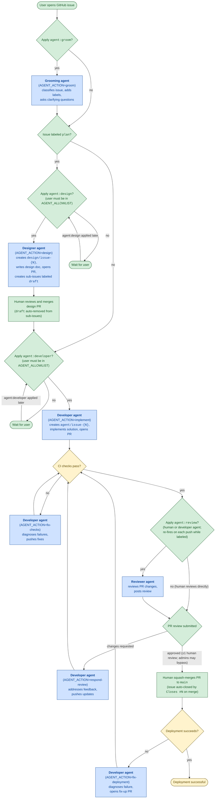

# agentic-development-workflow

A demonstration of AI coding agents integrated into a GitHub issue-based development lifecycle. Each agent has its own GitHub identity, runs in an isolated container per event, and interacts via PR and issue comments — the same channels a human contributor would use.

**This is a demonstration project, not an open project.** Pull requests are limited to collaborators. Issue reports from the public are welcome but may not be acted on. If you want to run this workflow yourself, see [Reproduce this yourself](#reproduce-this-yourself) below.

See [requirements.md](requirements.md) for the full project specification, [AGENTS.md](AGENTS.md) for agent conventions, and [CONTRIBUTING.md](CONTRIBUTING.md) for the contribution policy.

## What this demonstrates

This repository shows how coding agents can participate in a structured, human-gated software development lifecycle on GitHub:

- **Separate agent identities** — each agent (developer, reviewer) authenticates as its own GitHub App, so its actions are distinguishable from human collaborators and from each other.
- **Least-privilege, per-event isolation** — agents run in ephemeral containers, each receiving a short-lived installation token scoped to only the permissions that action requires.
- **Full issue → merge lifecycle** — from grooming and design through implementation, CI, code review, and deployment, every step is driven by GitHub labels and events; humans gate the transitions that matter (applying labels, approving PRs, merging).
- **Human-enforced branch protection** — branch protection on `main` requires at least one human review; agents cannot self-approve or push directly to `main`.

## Agent lifecycle

The complete flow from issue to deployment is:

**issue → groom → (design →) implement → CI → review → respond → merge → deploy**

- A human opens an issue and optionally applies `agent:groom` to classify it and surface clarifying questions.
- For complex issues the groomer applies the `plan` label; a human applies `agent:design` to produce a design document and draft sub-issues before implementation begins.
- A human applies `agent:developer` to trigger implementation on a fresh branch; the agent opens a PR.
- CI runs automatically; on failure the agent is re-invoked (`fix-checks`) to diagnose and push fixes.
- A human (or the agent itself) applies `agent:review` to request a code review from the reviewer agent.
- On review feedback the developer agent addresses it (`respond-review`) and pushes updates; the cycle repeats until the PR is approved.
- A human squash-merges the approved PR; the issue auto-closes via `Closes #N`.
- On deployment failure the agent opens a follow-up fix-up PR and the cycle restarts.

See [AGENTS.md](AGENTS.md) for the full list of `AGENT_ACTION` values and their required env vars.

## How it works

Day-to-day operation is driven entirely by GitHub labels and events. See [`AGENTS.md § Labels`](AGENTS.md#labels) for the full label reference — all `agent:*`, `model:*`, grooming, and lifecycle labels with their descriptions and workflow behavior.

- CI failure on an agent-authored PR → the agent is re-invoked to fix the checks. The `CI` workflow ([`.github/workflows/ci.yml`](.github/workflows/ci.yml)) runs type-checking and unit tests on every PR; `agent-fix-checks` triggers on its failures.
- Push to `main` → the agent checks all open developer-agent PRs for merge conflicts and resolves them automatically; each conflicted PR is resolved in its own parallel job so a single failure does not block the others. If the agent cannot resolve a conflict confidently, it aborts, applies `human-required`, and posts a PR comment naming the files that need manual attention. `workflow_dispatch` with a `pr_number` input is available as a manual backstop for a specific PR — for example, to manually re-trigger conflict resolution for PR #42:

  ```bash
  gh workflow run agent-resolve-conflicts.yml \
    --repo mfrancza/agentic-development-workflow \
    -f pr_number=42
  ```
- PR review submitted on an agent-authored PR → the agent addresses feedback and pushes.
- Deployment failure → the agent opens a follow-up fix-up PR. (Triggers on any `deployment_status` failure; skips cleanly unless it can map the failing deployment SHA to a PR containing `Closes #N`.)
- **Terraform CI pipeline** — every PR that touches `terraform/**` triggers a plan-on-PR workflow ([`.github/workflows/terraform-ci.yml`](.github/workflows/terraform-ci.yml)) that runs `fmt -check`, `validate`, and `terraform plan`, then posts the plan output as an evergreen PR comment so reviewers can see what will change. On merge to `main` the same workflow auto-applies the plan. The pipeline authenticates to GitHub as the `terraform-ci` App (minted via [`.github/actions/agent-token`](.github/actions/agent-token/action.yml)) and to HCP Terraform's state backend via `TF_API_TOKEN`. See [`docs/design/terraform-ci.md`](docs/design/terraform-ci.md) for the full design and threat-model rationale.
- **CI run logs** — container logs and Claude session transcripts are captured as workflow artifacts with 30-day retention. See [AGENTS.md](AGENTS.md#debugging) for download instructions and what each artifact contains.

Only usernames (and agent bot identities such as `<developer-agent-app-slug>[bot]`) in the Terraform-managed `AGENT_ALLOWLIST` can trigger the label-driven workflows (`agent:groom`, `agent:developer`, `agent:review`, `agent:design`). The agent bots are included so an agent can apply `agent:*` labels to hand work off — for example, the developer agent applying `agent:review` on its own PR to request a code review. Event-driven workflows then apply their own gates: `fix-checks`/`respond-review` run only for developer-agent PRs, and `fix-deployment` runs on any failed `deployment_status` event and skips cleanly unless it can map the deployment SHA to a PR containing `Closes #N`.

See [AGENTS.md](AGENTS.md) for the full list of `AGENT_ACTION` values and their required env vars.

## SDLC diagram

The diagram below shows the end-to-end issue → merge → deploy lifecycle, including which steps are performed by agents (blue) and which require a human decision (green). Label-driven triggers are shown on the edges.


```mermaid
flowchart TD
    Start([User opens GitHub issue]):::human --> GroomLabel{"Apply <code>agent:groom</code>?"}:::human

    GroomLabel -- "yes" --> Groom["<b>Grooming agent</b><br/>(AGENT_ACTION=groom)<br/>classifies issue, adds labels,<br/>asks clarifying questions"]:::agent
    GroomLabel -- "no" --> PlanCheck{"Issue labeled <code>plan</code>?"}:::human
    Groom --> PlanCheck

    PlanCheck -- "yes" --> DesignLabel{"Apply <code>agent:design</code>?<br/>(user must be in AGENT_ALLOWLIST)"}:::human
    PlanCheck -- "no" --> DevLabel{"Apply <code>agent:developer</code>?<br/>(user must be in AGENT_ALLOWLIST)"}:::human

    DesignLabel -- "yes" --> Design["<b>Designer agent</b><br/>(AGENT_ACTION=design)<br/>creates <code>design/issue-{N}</code>,<br/>writes design doc, opens PR,<br/>creates sub-issues labeled <code>draft</code>"]:::agent
    DesignLabel -- "no" --> WaitDesign([Wait for user]):::human
    WaitDesign -- "agent:design applied later" --> DesignLabel
    Design --> DesignMerge["Human reviews and merges<br/>design PR<br/>(<code>draft</code> auto-removed from sub-issues)"]:::human
    DesignMerge --> DevLabel

    DevLabel -- "no" --> Wait([Wait for user]):::human
    Wait -- "agent:developer applied later" --> DevLabel
    DevLabel -- "yes" --> Implement["<b>Developer agent</b><br/>(AGENT_ACTION=implement)<br/>creates <code>agent/issue-{N}</code>,<br/>implements solution, opens PR"]:::agent

    Implement --> CI{"CI checks pass?"}:::system
    CI -- "no" --> FixChecks["<b>Developer agent</b><br/>(AGENT_ACTION=fix-checks)<br/>diagnoses failures,<br/>pushes fixes"]:::agent
    FixChecks --> CI

    CI -- "yes" --> ReviewLabel{"Apply <code>agent:review</code>?<br/>(human or developer agent;<br/>re-fires on each push while labeled)"}:::human
    ReviewLabel -- "yes" --> ReviewerAgent["<b>Reviewer agent</b><br/>reviews PR changes,<br/>posts review"]:::agent
    ReviewLabel -- "no (human reviews directly)" --> Review{"PR review submitted"}:::human
    ReviewerAgent --> Review

    Review -- "changes requested" --> Respond["<b>Developer agent</b><br/>(AGENT_ACTION=respond-review)<br/>addresses feedback,<br/>pushes updates"]:::agent
    Respond --> CI

    Review -- "approved (≥1 human review; admins may bypass)" --> Merge["Human squash-merges PR to <code>main</code><br/>(issue auto-closed by <code>Closes #N</code> on merge)"]:::human
    Merge --> Deploy{"Deployment succeeds?"}:::system

    Deploy -- "no" --> FixDeploy["<b>Developer agent</b><br/>(AGENT_ACTION=fix-deployment)<br/>diagnoses failure,<br/>opens fix-up PR"]:::agent
    FixDeploy --> CI

    Deploy -- "yes" --> Done([Deployment successful]):::system

    classDef human fill:#d4edda,stroke:#155724,color:#155724
    classDef agent fill:#cfe2ff,stroke:#084298,color:#084298
    classDef system fill:#fff3cd,stroke:#664d03,color:#664d03
```

Notes on the diagram:

- **Human gates** (green) are the only places a person is required: opening the issue, applying `agent:*` labels, reviewing and merging the design PR, submitting a PR review, and squash-merging. Branch protection on `main` requires at least one human review before merge for non-admins — agents cannot self-approve. Repository admins can bypass the review requirement and merge via PR without a prior review (see the Terraform ruleset note in the [Reproduce this yourself](#reproduce-this-yourself) section).
- **Agent steps** (blue): developer agent steps each run as a fresh container invocation of the developer agent image (`docker/`) with a specific `AGENT_ACTION`; the reviewer agent step uses a separate image (`docker/reviewer/`) and performs exactly one action (review a PR). See [AGENTS.md](AGENTS.md#agent-actions) for the required env vars per action.
- **System checks** (yellow) are automated (GitHub Actions workflow checks, deployment status events) and drive the feedback loops back into the agent. The CI failure feedback loop (`fix-checks`) triggers when the `CI` workflow ([`.github/workflows/ci.yml`](.github/workflows/ci.yml)) fails — it runs type-checking and unit tests on every PR.
- `fix-deployment` re-enters the flow at the CI/checks stage because it opens a new PR that goes through the same CI → review → merge lifecycle as any other change (including the `fix-checks` feedback loop if checks fail).

## Reuse in another repo

The Terraform modules and GitHub Actions reusable workflows in this repo are
published as versioned artifacts — any repository can adopt them one component
at a time, from a single label set to the full agent pipeline.

See **[docs/adopting.md](docs/adopting.md)** for the complete consumer
adoption guide, including:

- Adoption profiles (labels-only, grooming only, review only, full pipeline)
- Common prerequisites (GitHub Apps, secrets, Terraform provider config)
- Version pinning strategy (`@v1` vs. `@v1.2.3` vs. `@<sha>`)
- Per-module and per-workflow sections with copy-paste wiring snippets
- Manual repository settings (fork-PR approval policy, interaction limit)

## Reproduce this yourself

The steps below describe how to wire up the same workflow in your own GitHub repository. Most repo-side configuration (Terraform settings, GitHub Actions workflows, and agent images) is in this repo — fork it and follow the steps; a few one-time manual steps outside version control (creating GitHub Apps, adding secrets) are also required and are covered in the steps below.

### 1. Create the agent GitHub Apps (one-time, manual)

Terraform cannot create GitHub Apps, so do this first in the GitHub UI under **Settings → Developer settings → GitHub Apps → New GitHub App**. Create three Apps:

**developer-agent**
- Repository permissions: Contents (R/W), Issues (R/W), Pull requests (R/W), Workflows (R/W), Metadata (R), Checks (R), Deployments (R)
- Subscribe to events: Issues, Pull request, Pull request review, Check run, Deployment status
- Webhook: **uncheck "Active"** — the GitHub UI otherwise requires a Webhook URL, and this project uses `workflow_dispatch` rather than webhooks.
- After creation: note the **Client ID** (labelled "Client ID" in the App's General settings page — a string like `Iv23.xxxxxxxxxxxxxxxx`, **not** the numeric "App ID") and generate + download a **private key** (`.pem`).

**reviewer-agent**
- Repository permissions: Contents (R), Issues (R/W), Pull requests (R/W), Metadata (R), Checks (R)
- Subscribe to events: Pull request, Pull request review, Issue comment
- Webhook: **uncheck "Active"** (same reason as above).
- After creation: note the **Client ID** (same as above — the `Iv23.xxx` string) and download the private key.

**terraform-ci**
- Repository permissions: Administration (R/W), Metadata (R), Contents (R), Issues (R/W), Actions (R/W)
- Subscribe to events: none (App is only used to mint tokens for Terraform runs; no webhook events needed).
- Webhook: **uncheck "Active"** (same reason as above).
- After creation: note the **Client ID** (the `Iv23.xxx` string) and download the private key.

Then install each App on this repository (sidebar → **Install App** → **Install** next to your username → **Only select repositories** → pick `agentic-development-workflow`). That per-repo selection is what scopes the App to this repo; Terraform deliberately does not manage App installations (the GitHub API endpoints for it reject OAuth user tokens, which is what `gh auth token` issues).

### 2. Run Terraform

```bash
cd terraform
cp terraform.tfvars.example terraform.tfvars
# Edit terraform.tfvars:
#   repo_owner           — GitHub user or org that owns the repo
#   repo_name            — repository name (default: agentic-development-workflow)
#   agent_allowlist      — GitHub usernames permitted to trigger agent workflows
#   default_model        — repo-wide default model (e.g. "sonnet")
#   auto_trigger_agents  — per-stage auto-trigger switches (all false by default;
#                          set a key to true to auto-apply that stage's agent:* label)
#   admin_assignees      — (optional) list of GitHub usernames assigned by the groom
#                          agent when it applies the human-required label; stored as
#                          the JSON-encoded ADMIN_ASSIGNEES Actions variable; omit or
#                          set to [] to skip
#   code_reviewers       — (optional) list of GitHub usernames to request as PR
#                          reviewers when the implement agent determines human review
#                          is warranted; stored as the JSON-encoded CODE_REVIEWERS
#                          Actions variable; omit or set to [] to request no specific
#                          reviewers

export GITHUB_TOKEN=$(gh auth token)  # or any token with `repo` scope

# TF_API_TOKEN authenticates to the HCP Terraform remote state backend.
# Generate a token in the HCP Terraform UI under User Settings → Tokens,
# then export it before running terraform init:
export TF_API_TOKEN="<hcp-terraform-api-token>"

terraform init

# Import the repo. The ID is the plain repo name — whatever you set for
# var.repo_name in terraform.tfvars (default: agentic-development-workflow).
terraform import github_repository.this "$(terraform console <<<'var.repo_name' | tr -d '"')"

terraform plan
terraform apply  # first-time bootstrap only; subsequent applies run via the CI pipeline
```

**If you already have local state from a previous `terraform apply` run** (i.e.
a `terraform.tfstate` file exists in `terraform/`), run `terraform init
-migrate-state` instead of `terraform init` to copy the existing state into the
HCP workspace before the first CI-driven apply:

```bash
terraform init -migrate-state
# Terraform prompts: "Do you want to copy existing state to the new backend? yes"
```

After migration the HCP workspace holds the canonical state. Local
`terraform apply` is reserved for the initial bootstrap (before CI is live)
and break-glass situations — ongoing applies run automatically via CI on every
merge to `main` that touches `terraform/**`. See
[`docs/design/terraform-ci.md`](docs/design/terraform-ci.md) Decision 7 and
the State backend bootstrap section for the full sequence.

Terraform will:
- Codify repo settings (squash-merge only, delete branch on merge, etc.).
- Apply branch protection on `main` via a repository ruleset (PR review required, no force pushes, no deletion, linear history — direct pushes to `main` blocked for everyone, admins included; admins can bypass review only via PR merges).
- Publish `AGENT_ALLOWLIST`, `DEFAULT_MODEL`, and `AUTO_TRIGGER_AGENTS` as repo-level Actions variables so workflows reference them without hardcoding values in YAML.
- Create the labels consumed by the agent workflows (`agent:developer`, `agent:groom`, `agent:review`, `agent:design`, the Anthropic tier aliases `model:sonnet`/`model:opus`/`model:haiku` plus the generic series tags and pinned snapshot IDs for the currently active Claude model families, the OpenAI and xAI `model:*` labels, the grooming labels `question`/`bug`/`enhancement`/`dependency upgrade`/`do`/`plan`, `human-required` for issues/PRs needing a human in the loop, `draft` for sub-issues scoped by an unmerged design, and `blocked` for issues whose `agent:developer` trigger was deferred pending blocker closure) so they show up in the GitHub label picker on issue and pull request creation.

If `terraform apply` errors with `422 already_exists` on a default GitHub label (`bug`, `enhancement`, `question` — these ship pre-created on new repos), import them and re-apply:

```bash
terraform import 'github_issue_label.automation["bug"]'         "$(terraform console <<<'var.repo_name' | tr -d '"'):bug"
terraform import 'github_issue_label.automation["enhancement"]' "$(terraform console <<<'var.repo_name' | tr -d '"'):enhancement"
terraform import 'github_issue_label.automation["question"]'    "$(terraform console <<<'var.repo_name' | tr -d '"'):question"
```

App private keys are deliberately **not** managed by Terraform — keeping them out of `terraform.tfstate` is the whole point. Set them as repo Actions secrets out of band (next step).

### 3. Set App credentials and API keys as Actions secrets

Run once after `terraform apply`, and again whenever you rotate a key:

```bash
# Required — used by all current agent workflows
gh secret set DEVELOPER_APP_ID         --body "<developer App Client ID>"  # the Iv23.xxx Client ID, not the numeric App ID
gh secret set DEVELOPER_APP_PRIVATE_KEY < ~/.config/agentic-agents/developer-agent.pem
gh secret set ANTHROPIC_API_KEY        --body "<anthropic api key>"
gh secret set OPENAI_API_KEY           --body "<openai api key>"      # optional if not using OpenAI models
gh secret set XAI_API_KEY             --body "<xai api key>"         # optional if not using Grok models

# Required for the reviewer agent (used by agent-review.yml)
gh secret set REVIEWER_APP_ID          --body "<reviewer App Client ID>"   # the Iv23.xxx Client ID, not the numeric App ID
gh secret set REVIEWER_APP_PRIVATE_KEY < ~/.config/agentic-agents/reviewer-agent.pem

# Required for the terraform-ci App (used by terraform-ci.yml)
gh secret set TERRAFORM_APP_ID         --body "<terraform-ci App Client ID>"  # the Iv23.xxx Client ID, not the numeric App ID
gh secret set TERRAFORM_APP_PRIVATE_KEY < ~/.config/agentic-agents/terraform-ci.pem

# Required for HCP Terraform remote state backend (used by terraform-ci.yml and local terraform init)
gh secret set TF_API_TOKEN             --body "<hcp-terraform-api-token>"  # generate in HCP UI: User Settings → Tokens
```

Workflows use `DEVELOPER_APP_ID` / `DEVELOPER_APP_PRIVATE_KEY` to mint short-lived installation tokens for developer-agent runs, and `REVIEWER_APP_ID` / `REVIEWER_APP_PRIVATE_KEY` for reviewer-agent runs (`agent-review.yml`). All workflows pass `ANTHROPIC_API_KEY` through to the container. **Important:** despite the `_APP_ID` suffix, these secrets must hold the GitHub App **Client ID** (the `Iv23.xxx` string visible in the App's General settings), which is the value forwarded as `client-id` to `actions/create-github-app-token`. The separate numeric "App ID" shown on the same page is not used here.

To verify all secrets are configured before triggering a workflow run, list the secret names (values are never exposed):

```bash
gh secret list --repo <owner>/<repo>
```

For the Terraform CI pipeline specifically, confirm that `TERRAFORM_APP_ID`, `TERRAFORM_APP_PRIVATE_KEY`, and `TF_API_TOKEN` all appear in the output. If any are missing, re-run the corresponding `gh secret set` command above. A missing secret causes `startup_failure` on the Terraform CI workflow before any job starts — `gh secret list` is the fastest way to identify which secret is absent.

### 4. Build the developer agent container

The image is built on-demand inside each workflow (see [`.github/workflows/`](.github/workflows/)). To build locally for testing:

```sh
docker build -t agent-developer ./docker
```

Run locally against an issue (example — `AGENT_ACTION=implement`):

```sh
# Export secrets into your shell first; using -e VARNAME (not -e KEY=VALUE) keeps
# values out of the docker run command text and shell history
# (the values will still be present in the container environment).
export GH_TOKEN=$(gh auth token)    # or set from another source
[ -n "${ANTHROPIC_API_KEY:-}" ] || { read -rsp "ANTHROPIC_API_KEY: " ANTHROPIC_API_KEY && echo && export ANTHROPIC_API_KEY; }

docker run --rm \
  -v "$PWD/logs:/home/agent/logs" \
  -e ANTHROPIC_API_KEY \
  -e GH_TOKEN \
  -e GITHUB_REPO="owner/repo" \
  -e AGENT_ACTION="implement" \
  -e GITHUB_ISSUE_NUMBER="1" \
  -e AGENT_MODEL="sonnet" \
  agent-developer
```

See [AGENTS.md](AGENTS.md#agent-actions) for the full matrix of `AGENT_ACTION` values and their required env vars.

### 5. Build and run the reviewer agent container

The reviewer image lives at `docker/reviewer/`, separate from the developer image at `docker/`. In CI, `agent-review.yml` builds and runs it automatically when the `agent:review` label is applied to a PR. The same image can be run locally to validate a review pass against a real PR.

**Build**

```sh
docker build -t agent-reviewer ./docker/reviewer
```

**Credentials**

The container needs a GitHub token (`GH_TOKEN`) with **Contents read**, **Pull requests read/write**, and **Checks: read**, and an Anthropic API key (`ANTHROPIC_API_KEY`). For local testing, your personal token is the simplest source:

```sh
export GH_TOKEN=$(gh auth token)
read -rsp "ANTHROPIC_API_KEY: " ANTHROPIC_API_KEY && echo && export ANTHROPIC_API_KEY
```

Use `-e VARNAME` (without `=value`) so Docker reads each secret from your shell environment — the value does not appear in the `docker run` command text or shell history:

```sh
docker run --rm \
  -e ANTHROPIC_API_KEY \
  -e GH_TOKEN \
  -e GITHUB_REPO="owner/repo" \
  -e GITHUB_PR_NUMBER="42" \
  agent-reviewer
```

To mint a reviewer-agent installation token that matches the CI identity exactly, or to set up a persistent credentials file, see [`docs/local-reviewer-setup.md`](docs/local-reviewer-setup.md).

The entrypoint clones the repo read-only, gathers the diff against the merge-base, fetches open review threads and CI check status, invokes Claude, then verifies that a review by the authenticated GitHub identity was posted against the PR head SHA — exiting non-zero if the agent did not complete the review.

### Published container images

The developer and reviewer images are published to GHCR on every `v*` tag push by [`.github/workflows/release-images.yml`](.github/workflows/release-images.yml). Two tags are published per release:

- **Full tag** (e.g. `v1.2.3`) — immutable; pin to this for reproducible runs.
- **Major tag** (e.g. `v1`) — a moving pointer updated on every release within the same major version; use this to receive automatic patch and minor updates.

```
ghcr.io/mfrancza/agentic-development-workflow/developer:v1.2.3
ghcr.io/mfrancza/agentic-development-workflow/developer:v1
ghcr.io/mfrancza/agentic-development-workflow/reviewer:v1.2.3
ghcr.io/mfrancza/agentic-development-workflow/reviewer:v1
```

**Pull mode vs build mode in the `run-agent` composite action**

The [`.github/actions/run-agent`](.github/actions/run-agent/action.yml) composite action supports two modes, controlled by the `image` input:

- **Pull mode** (`image` is set): pulls the specified image from a registry and runs it — no local Docker build required. Use this when calling the workflows from an external repo that does not have the `docker/` source tree in its workspace.
- **Build mode** (`image` is empty, default): builds the image from the `build-context` directory before running. This repo's own workflows use build mode so that uncommitted changes in `docker/` take effect immediately without waiting for a release.

To manually re-run the release workflow against an existing tag (e.g. to update the GHCR package after a registry incident):

```bash
gh workflow run release-images.yml \
  --repo mfrancza/agentic-development-workflow \
  --ref v1.2.3 \
  -f tag=v1.2.3
```

## What's included

- Developer agent container with seven actions: `implement`, `groom`, `design`, `fix-checks`, `resolve-conflicts`, `respond-review`, `fix-deployment`.
- Grooming agent with label criteria in [`agents/grooming/label-criteria.json`](agents/grooming/label-criteria.json).
- GitHub Actions workflows for each action under [`.github/workflows/`](.github/workflows/), plus a `CI` workflow ([`.github/workflows/ci.yml`](.github/workflows/ci.yml)) that runs `tsc --noEmit` and `vitest run` on every PR, and a `release-images` workflow ([`.github/workflows/release-images.yml`](.github/workflows/release-images.yml)) that publishes both agent images to GHCR on each `v*` tag.
- Shared TypeScript package at [`.github/scripts/`](.github/scripts/) for workflow activities (complex logic extracted from inline `run:` blocks); see [AGENTS.md](AGENTS.md#workflow-activity-conventions) for conventions.
- Terraform for repo settings, `main` branch-protection ruleset, and repo-level `AGENT_ALLOWLIST` / `DEFAULT_MODEL` / `AUTO_TRIGGER_AGENTS` Actions variables.
- Claude model override via `model:<name>` labels on issues (developer/grooming/fix-deployment runs) and PRs (reviewer agent runs).
- Local run guides for the developer agent ([Build the developer agent container](#4-build-the-developer-agent-container)) and the reviewer agent ([Build and run the reviewer agent container](#5-build-and-run-the-reviewer-agent-container)).

## Releasing

Releases follow semantic versioning: bump the **patch** version (`v1.2.3 → v1.2.4`) for bug fixes, documentation corrections, and internal refactors that do not change any consumer-facing contract; bump the **minor** version (`v1.2.3 → v1.3.0`) for backwards-compatible additions (new reusable workflow inputs with defaults, new optional Terraform variables, new composite action inputs that are not required); bump the **major** version (`v1.2.3 → v2.0.0`) for any breaking change to a reusable workflow's `inputs:` / `secrets:` surface, a Terraform module's required variables, or a composite action's inputs. The rationale for this contract is in [Decision 6 of the design doc](docs/design/publish-reusable-workflows-and-modules.md#decision-6--versioning-semver-tags-with-a-moving-major-tag).

To cut a release, dispatch the [`release` workflow](.github/workflows/release.yml) from the Actions UI (or via `gh workflow run release.yml -f version=v1.2.3`). The workflow validates the version format, creates an annotated git tag and a moving major tag (e.g. `v1`), pushes both, and publishes a GitHub Release with auto-generated notes. The [`release-images` workflow](.github/workflows/release-images.yml) then fires automatically on the tag push to build and publish the updated container images to GHCR.

## Debugging

Agent container logs and Claude session transcripts are captured as GitHub Actions workflow artifacts after each run. **Agent log artifacts are retained for 30 days.** Download artifacts before they expire using:

```bash
gh run download <run-id> --name <artifact-name>
```

For details on artifact names and contents, see [AGENTS.md](AGENTS.md#debugging).

## Security defaults

The following security settings are active on this repository. See [AGENTS.md](AGENTS.md#repo-specific-security-defaults) for the full list of security patterns the reviewer agent and human reviewers enforce on every PR.

- **Secret scanning** — GitHub natively scans the full commit history for secret patterns and posts alerts; enabled via `security_and_analysis` in [`terraform/main.tf`](terraform/main.tf). Complements the existing [`secret-scan.yml`](.github/workflows/secret-scan.yml) gitleaks workflow (different detection engine; both are active).
- **Push protection** — GitHub blocks pushes containing detected secret patterns at the git server before they enter the history; enabled alongside secret scanning in `terraform/main.tf`.
- **`allowed_actions = "selected"`, GitHub-owned only** — only GitHub-owned actions (e.g., `actions/*`, `github/*`) are permitted to run in workflows; local actions under `./.github/actions/` are referenced by path and are not subject to the `allowed_actions` policy. Configured via the `actions-policy` module ([`terraform/modules/actions-policy/main.tf`](terraform/modules/actions-policy/main.tf)) with `github_owned_allowed = true`, `verified_allowed = false`, and an empty `patterns_allowed`. If a workflow adds a non-GitHub, non-local action, the author must also add the pattern to `var.patterns_allowed` in the `module "actions_policy"` call in [`terraform/main.tf`](terraform/main.tf) with a full-SHA pin — omitting the entry causes a loud workflow failure, not a silent bypass.
- **Fork-PR approval policy: all external contributors** — workflow runs triggered by fork PRs from external contributors (users without write access) require explicit approval before running; set to `all_external_contributors` via Settings → Actions → General or Terraform (see issue [#185](https://github.com/mfrancza/agentic-development-workflow/issues/185)).
- **Interaction limit: `collaborators_only`** — non-collaborators cannot open issues or PRs; applied manually at flip time and renewed every six months via the reminder-issue workflow ([#176](https://github.com/mfrancza/agentic-development-workflow/issues/176)). See [`docs/design/public-visibility-flip.md`](docs/design/public-visibility-flip.md#flip-day-runbook) for the renewal command. **Note ([#195](https://github.com/mfrancza/agentic-development-workflow/issues/195)):** the limit was deliberately allowed to lapse at its 2027-01-16 expiry and is not renewed — the standing controls (AGENT_ALLOWLIST sender gates, same-repo head guards, and the fork-PR approval policy) serve as the boundary; any maintainer can re-apply the limit manually as needed.

## Public-flip runbook

The step-by-step procedure for flipping the repository from private to public — including pre-flip gate checks, staged Terraform applies, fork-PR approval policy, interaction-limit setup, and post-flip verification — is documented in [`docs/design/public-visibility-flip.md`](docs/design/public-visibility-flip.md#flip-day-runbook).
