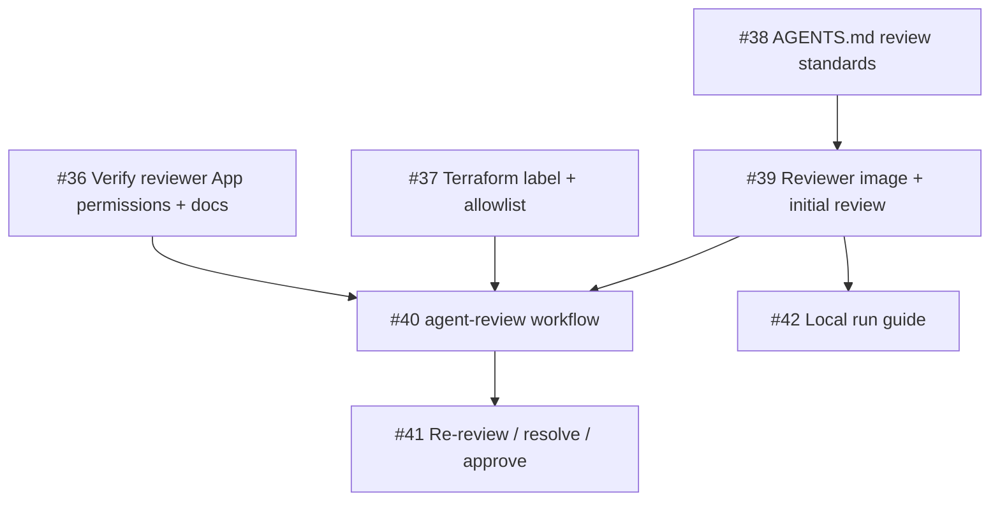

# Design: Code Review Agent

**Issue:** [#27](https://github.com/mfrancza/agentic-development-workflow/issues/27)

## Summary

Add a code review agent that posts the initial review on a PR, re-reviews when
the PR is updated, resolves conversations that have been addressed, and
approves when all issues are resolved. This is the "AI reviewer" step of the
MVP workflow (`AGENTS.md` step 5, `requirements.md`), and the counterpart to
the existing `agent-respond-review` workflow in which the *developer* agent
responds to reviews on its PRs.

## Requirements (from issue #27 grooming Q&A)

1. **Trigger** — review starts when a trigger label is applied to a PR by an
   allowlisted user (managed via Terraform, like the other labeling
   permissions) or by one of the agents. Re-review happens automatically when
   the PR is updated.
2. **Identity** — the reviewer uses a separate GitHub App identity from the
   developer agent (least privilege; review independence).
3. **Scope** — correctness, security, style/conventions, test coverage, and
   adherence to requirements. Code review best practices live in `AGENTS.md`;
   adding sensible defaults for this repo is in scope.
4. **Image** — the reviewer runs in its own Docker image, separate from the
   developer agent image.
5. **Acceptance** — the agent posts inline PR comments, re-reviews on update,
   resolves conversations when addressed, and approves the PR when all issues
   are resolved.

## Design

### Identity: `reviewer-agent` GitHub App

A separate reviewer GitHub App already exists: the `REVIEWER_APP_ID` and
`REVIEWER_APP_PRIVATE_KEY` repository secrets were provisioned alongside the
developer app. Remaining identity work is verification and documentation, not
creation.

- **Permissions (to verify):** Contents (read, for cloning),
  Pull requests (read/write, to submit reviews, reply to threads, and
  approve), Issues (read, for context). No push access to the repo contents —
  the reviewer never commits code.
  Note: the bootstrap instructions in README.md currently provision the
  reviewer app with Issues (R/W) and Checks (R). Reconciling that with this
  least-privilege target is part of [#36](https://github.com/mfrancza/agentic-development-workflow/issues/36)
  — PR conversation comments only need Pull requests (write), so Issues can
  likely be trimmed to read; Checks (read) is harmless to keep for CI context.
- **Secrets:** `REVIEWER_APP_ID` and `REVIEWER_APP_PRIVATE_KEY`, minted into
  short-lived installation tokens with `actions/create-github-app-token`,
  exactly like the developer app.
- GitHub Apps cannot be created by Terraform; the app was created manually (as
  the developer app was) and its setup steps should be documented alongside
  the existing bootstrap instructions.

Because reviews from the reviewer app satisfy the ruleset's
`required_approving_review_count = 1`, an approval from the reviewer makes the
PR mergeable by the human operator. `dismiss_stale_reviews_on_push = true`
already ensures a stale approval is dismissed if the developer agent pushes
again after approval.

### Trigger: `agent:review` label + PR update

A new Terraform-managed label `agent:review` (same `agent:*` family as
`agent:developer` / `agent:groom`) and a new workflow
`.github/workflows/agent-review.yml`:

```yaml
on:
  pull_request:
    types: [labeled, synchronize]
```

- **`labeled`** — start a review when `agent:review` is applied and the sender
  is in `vars.AGENT_ALLOWLIST`. Agent identities (e.g.
  `mfrancza-developer-agent[bot]`) are added to the `agent_allowlist`
  Terraform variable so agents can request reviews too — no new mechanism
  needed.
- **`synchronize`** — re-review when new commits are pushed to a PR that
  carries the `agent:review` label. The label acts as the opt-in flag for
  continuous review, so there is no need to track review state elsewhere.

Concurrency group `agent-review-pr-<number>` with `cancel-in-progress: false`,
matching the other agent workflows.

Model selection reuses the existing pattern: `model:<name>` labels on the PR
override `vars.DEFAULT_CLAUDE_MODEL`.

### Image: separate reviewer container

A new image under `docker/reviewer/` (build context `./docker/reviewer`) with
its own `Dockerfile`, `entrypoint.sh`, and `prompts/`. The existing developer
image at `docker/` is untouched, so no existing workflow changes are needed.
The reviewer Dockerfile starts from the same base recipe (node + gh + pinned
Claude Code CLI, non-root user) but only ships review prompts and a
review-only entrypoint — it has no push/commit code paths at all, which keeps
the no-write guarantee structural rather than prompt-enforced.

Entrypoint contract (mirrors the developer entrypoint):

- Required env: `ANTHROPIC_API_KEY`, `GH_TOKEN`, `GITHUB_REPO`,
  `GITHUB_PR_NUMBER`; optional `CLAUDE_MODEL`, `CLAUDE_MAX_TURNS`.
- Clones the repo read-only, checks out the PR head, gathers the diff against
  the merge-base, existing review threads (with IDs), and CI check status,
  then runs Claude with a `review.md` system prompt.

### Review behavior

**Initial review** (label applied): review the full diff against the standards
in `AGENTS.md`, post one review with inline comments pinned to file/line, and
a verdict:

- `REQUEST_CHANGES` when there are blocking findings,
- `COMMENT` for advisory-only feedback,
- `APPROVE` when the diff is clean.

**Re-review** (PR updated): fetch prior review threads, determine which are
addressed by the new commits, resolve those conversations (GraphQL
`resolveReviewThread` — thread IDs are collected by the entrypoint), comment
on remaining or new findings, and `APPROVE` once nothing blocking remains.

**Review standards** live in a new "Code Review Standards" section of
`AGENTS.md` covering the agreed scope (correctness, security,
style/conventions, test coverage, adherence to the linked issue's
requirements) plus repo-specific defaults (e.g. workflow security patterns
already used here: allowlist gating, output-injection hygiene, pinned
actions). The reviewer prompt references this section so humans and the agent
share one source of truth.

### Interaction with existing workflows (the review loop)

```
label applied ──► agent-review posts review ──► agent-respond-review
     ▲                                            (developer fixes, replies,
     │                                             pushes)
     └────────────── synchronize ◄────────────────────┘
```

The loop terminates when the reviewer approves. Two guards:

1. `agent-respond-review` is updated to skip reviews whose state is
   `APPROVED` with no unresolved comments, so an approval doesn't spin up a
   pointless developer-agent run.
2. The reviewer only runs on PRs carrying `agent:review`; removing the label
   halts the loop at any time. Timeout + concurrency settings bound each run.

### Known limitation: conflicted PRs

GitHub does not create workflow runs for `pull_request` / `pull_request_review`
events while a PR has merge conflicts (observed on PR #26: a review submitted
during a conflict window never triggered `agent-respond-review`, and the event
is not replayed after resolution). Consequence for this design: if a PR
becomes conflicted, `synchronize` re-reviews stop until the conflict is
resolved. Mitigation: re-applying the `agent:review` label after resolving
conflicts restarts the review; document this in `AGENTS.md` and `README.md`. See
[`docs/design/re-review-loop.md`](re-review-loop.md) (issue #41) for the
end-to-end documentation of the re-review loop and this limitation's user-facing note.

## Out of scope

- Automated merging — a human merges after approvals (per the MVP workflow).
- Reviewing PRs not opted in via the `agent:review` label.
- Creating the GitHub App via Terraform (not supported by the provider).

## Task breakdown and dependencies

| Issue | Task | Depends on |
|-------|------|-----------|
| [#36](https://github.com/mfrancza/agentic-development-workflow/issues/36) | Verify reviewer GitHub App permissions + document setup | — |
| [#37](https://github.com/mfrancza/agentic-development-workflow/issues/37) | Terraform: `agent:review` label; add agent identities to allowlist | — |
| [#38](https://github.com/mfrancza/agentic-development-workflow/issues/38) | AGENTS.md: Code Review Standards section | — |
| [#39](https://github.com/mfrancza/agentic-development-workflow/issues/39) | Reviewer Docker image + initial-review behavior | #38 |
| [#40](https://github.com/mfrancza/agentic-development-workflow/issues/40) | `agent-review.yml` workflow (label trigger) | #36, #37, #39 |
| [#41](https://github.com/mfrancza/agentic-development-workflow/issues/41) | Re-review on update: synchronize trigger, resolve threads, approve; respond-review loop guard | #40 |
| [#42](https://github.com/mfrancza/agentic-development-workflow/issues/42) | Local run guide for the reviewer agent | #39 |



Issues #36–#38 can proceed in parallel; #40 integrates them; #41 completes
the acceptance criteria.

Dependencies are also recorded natively on the issues themselves using
GitHub's blocked-by relationships, so blocked work is visible directly in the
issue UI without consulting this table.
